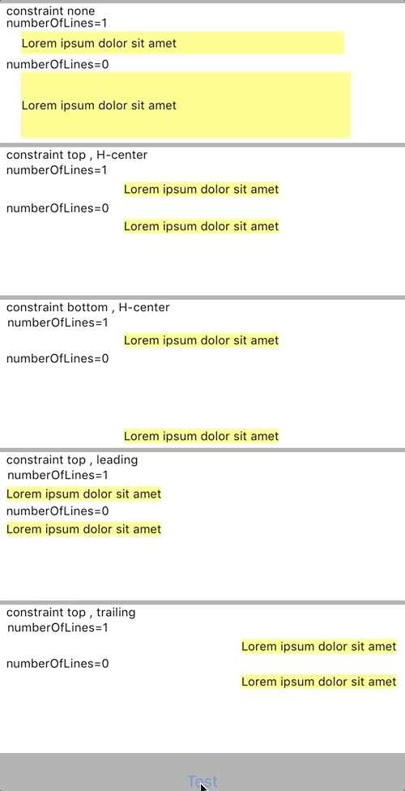
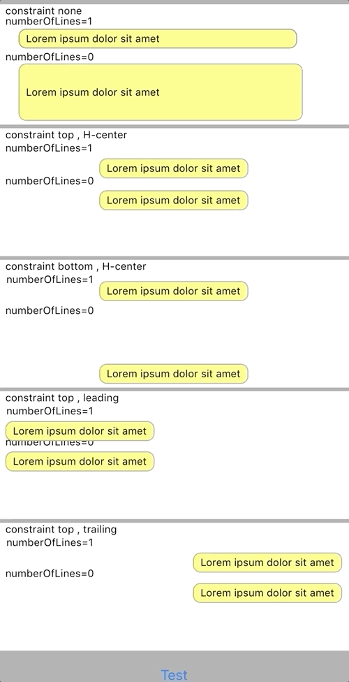

# UILabelExample
UILabel with various parameter.

# UILabel and autolayout

This is a result of how UILabel is resized, when UILabel numberOfLines is set to 0 and multiple lines of text are displayed.

# UILabel with corner radius and padding

UILabelRounded is custom class of UILabel.
This is a custom class for adding margins and rounded corners to UILabal.

